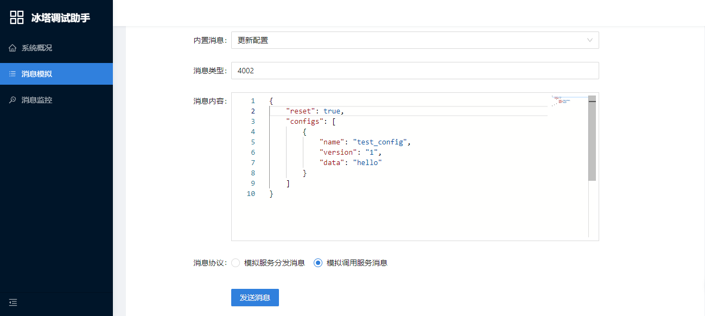

> 团队人力不足，怎么快速实现产品需求？
>
> 团队越来越大，怎么提高上百人的团队协同开发效率？
>
> 没有终端研发基因，怎么快速组建一个跨平台的终端团队？
>
> 业务频繁变更，框架怎么设计才能不被业务反向驱动而经常重构？
>
> 甲方要求各种定制化，怎么保证不因分支太多而焦头烂额？

# iFoundation

**冰塔** 是一个基于消息驱动的插件化快速开发框架。目标是建立标准化规范，让散乱的模块聚沙成塔，快速组合成不同的产品形态。适用于各类终端产品的底层架构。利用本框架可以分离业务与逻辑，让相同的逻辑复用于不同的业务产品，同时提供丰富的组件，极大的提高开发效率。

## 设计背景

希望设计一个简单稳定的开发框架，可以用于目前的业务，同时适用于未来的其他业务场景。

需要支持插件化，可以让不同团队高效协同开发。

需要支持对外开放，允许任何第三方开发者自己开发插件来扩展业务。

需要支持高度定制化，满足ToB的各种企业定制需要。

需要提供配套的开发、调试、测试工具，降低开发难度，提高开发效率。

## 框架特点

-  **简单稳定：** 框架的接口、使用足够简单，而且保证不受业务变化而改变。
-  **方便扩展：** 在接口不变的情况下，可以通过扩展来满足任何业务需要。
-  **开放平台：** 允许第三方开发者协同开发。
-  **积木组合：** 不同插件可以组合出不同的业务需求，每一个插件都可以轻易替换定制。
-  **质量保障：** 内部集成调试、测试、mock等各类工具。

## 框架组成

-  **插件管理：**  负责插件的注册、加载、动态卸载、热更新
-  **消息管理：**  负责插件消息的分发、监控、拦截、模拟、统计
-  **接口管理：**  负责插件依赖接口的创建
-  **进程管理：**  负责多进程模型下子进程的管理、进程间通信、消息的跨进程分发

## 插件类型

-  **服务插件：** 分发消息、响应调用（响应消息）
-  **业务插件：** 监听消息、调用服务（发送消息）
-  **扩展插件：** 通过依赖注入提供扩展接口给服务插件、业务插件使用

## 配套工具

-  **插件加载器：** 可以使用加载器来调试某一个模块，大大降低开发调试的成本。
-  **脚本模拟器：** 一些插件可能需要某些场景才能正常启动，使用模拟脚本可以构造出相同的场景，方便测试到所有的路径。
-  **调试服务器：** 在客户端会内置一个小型的服务器，通过服务器页面可以模拟分发消息、服务调用，也监控整个框架的消息流转过程。
-  **自动化测试：** 整个系统是基于消息驱动的，将这些消息录制保存起来，通过回放的方式，就可以对某一个插件做自动化测试。



## 快速接入

在介绍设计细节之前，先介绍一下使用的过程，让大家对框架有初步的概念。

#### 登录审计业务插件代码示例：

```c++
class cxPluginUserInfo : public cxPluginImpl<cxPluginUserInfo>
{
public:
	HRESULT Start(void) override {
        Subscribe([this](const MSG_PROTOCOL_BROADCAST_UserLogin& Message) {
			Report(emNetCommandStatusReportUserLogin, ProtocolUserLogin(Message.SessionId).Serialize());
		});
        
        return S_OK;
	}
};

1. 从cxPluginImpl继承，会自动导出实现必要的插件接口。
2. 订阅需要的消息（MSG_PROTOCOL_BROADCAST_UserLogin 的生成参考后面消息协议）。
3. 在收到用户登录消息后，生成完整的必要信息后，调用上报接口发送消息。
```

#### 数据上报服务插件代码示例：

```c++
class cxPluginDataReport : public cxPluginServiceImpl<cxPluginDataReport>
{
public:
	HRESULT Start(void) override {
        Handle(MSG_TYPE_DATAREPORT_Report, [this](const auto& Message) {
            ULONG type = Message["type"];
			cxAString data = Message["data"];
            auto result_future = GetNetworkManager()->Post(emNetCommandDataReport, ProtocolDataReport(type, data).Serialize());
            result_future.Then([](const auto& Result){
                LOG << "report result =" << Result.IsSuccess();
            });
		});
        
        // 模拟每秒触发一次登录事件的逻辑：演示消息分发过程
        GetMainLooper()->SetTimer(m_TimerScope, [this](){
			MSG_PROTOCOL_BROADCAST_UserLogin msg;
            msg.SessionId = 1234;
            DispatchMessage(msg);
        }, 1000);
  
        return S_OK;
	}
    
private:
    cxTimerScope m_TimerScope;
};

1. 从cxPluginServiceImpl继承，会自动导出实现必要的插件接口。
2. 设置响应消息的函数调用
3. 收到数据上报后，使用网络接口上报到后台。
4. 为了方便演示分发消息，使用线程池模块，定时每秒触发一次登录事件。
```

#### 消息协议：

框架的接口统一使用了Variant + Future的规范，为了明确知道Variant里面存储的类型，会有工具自动生成二进制兼容的消息结构体。


```c++
使用IDL方式

namespace BROADCAST;

struct UserLogin {
    SessionId: uint32;
}

使用宏的方式：
BEGIN_MSG_PROPERTY_MAP(BROADCAST_UserLogin)
	MSG_PROPERTY_MAP(uint32_t, SessionId)
END_MSG_PROPERTY_MAP()

使用的时候：
MSG_PROTOCOL_BROADCAST_UserLogin msg;
msg.SessionId = 1234;

也可以使用原始的方式：
cxVariant msg;
msg["SessionId"] = 1234;

两者的二进制完全兼容，而且编译生成的代码完全一样！具体的实现参考Variant设计部分。
```

更多的使用可以参考sample目录。

## 框架接口设计

### 消息服务接口

> C++的接口设计难点不仅在设计本身，同时也要兼容不同的编译器和运行时库（MT、MD），需要做到接口二进制兼容，还需要管理对象的生命周期，处理异步多线程等问题。

整个框架是基于消息驱动的，所以最核心的就是消息服务的接口。

```c++
// using cxFuture = cxVariantFuture;
// using cxMessge = const cxVariant&;

interface IMessageCallback : virtual public IUnknown
{
	virtual void		OnMessage	        (uint32_t Type, cxMessage Message) = 0;
};

interface IMessageService : virtual public IUnknown
{
	virtual HRESULT		RegisterCallback	(uint32_t Type, IMessageCallback* Callback) = 0;
	virtual HRESULT		UnregisterCallback	(uint32_t Type, IMessageCallback* Callback) = 0;
	virtual	cxFuture	Call				(uint32_t Type, cxMessage Message = EMPTY_MESSAGE) = 0;
};
```

接口的每一个参数、每一个函数，都是通过无数次讨论、调整后最终确定的。

接口是完全二进制兼容，不会因为插件的编译器、运行时库不一样而导致异常。

同时会提供接口胶水层，让插件可以使用任意语言来实现（比如JavaScript、Rust）。

这主要是依赖于Variant跟Future的优秀设计，详细参考Variant、Future设计部分。

### 插件接口

插件接口比较简单，只有Start、Stop。如果需要一些插件加载完毕等事件，可以订阅对应的事件。

```c++
interface IPluginContext : public IUnknown
{
	virtual HRESULT		CreateInterface	(REFIID iid, PVOID* ppInterface) = 0;
	virtual HRESULT		CreateInterface	(REFCLSID clsid, REFIID iid, PVOID* ppInterface) = 0;
};

interface IPlugin : virtual public IUnknown
{
	virtual HRESULT		Start			(IPluginContext* lpContext) = 0;
	virtual HRESULT		Stop			(IPluginContext* lpContext) = 0;
};

interface IPluginService : virtual public IPlugin, virtual public IMessageService
{
	virtual uint32_t	GetServiceType	(void) = 0;
	virtual const char* GetServiceName	(void) = 0;
};
```

### 接口优化

> 接口是基于COM规范的接口，如果对COM不熟悉的，强烈建议看看《COM本质论》的前两章。
>
> COM是一种接口标准规范，关注其思想，而非接口本身。很多人讨厌COM，认为是过时的，或者过于复杂，都是对其本质未理解导致的。

接口层非常简单，也会带来一些问题，直接基于上面的接口开发成本还是比较大的，特别是很多对COM机制不熟悉的同学。

框架会提供封装层，使用现代C++的优秀特性，将对接口使用的复杂性完全屏蔽，让使用者拥有更加丝滑的开发体验。

#### 如何快速实现一个COM接口的对象呢？

```c++
// template<typename T, typename... I>
// class cxCOMImpl : public cxCOMIUnknownImpl<cxCOMImpl<T, I...>, I...>;

实现一个COM接口：跟普通的接口使用方式一模一样，只需要实现虚函数就好了，cxCOMImpl会将IUnknown以及其他细节全部隐藏掉。
class Plugin : cxCOMImpl<Plugin, IPlugin> {
public:
	HRESULT		Start			(IPluginContext* lpContext) override;
	HRESULT		Stop			(IPluginContext* lpContext) override;
}

接口的导出：
COM_EXPORT_INTERFACE(Plugin, IPlugin) // 导出接口的方式
COM_EXPORT_INTERFACE_SINGLETON(Plugin, IPlugin) // 导出单例接口的方式
COM_EXPORT(Plugin) // 传统使用IClassFactory导出的方式，兼容标准COM接口，可以作为shell扩展等
COM_EXPORT_SINGLETON(Plugin) // 传统使用IClassFactory单例导出的方式
```

当然，对于插件开发来说，还会做进一步地封装和优化，将更多的细节隐藏，比如消息的订阅、分发过程。

同时线程池的使用过程，也会将现代C++的lambda表达式转换成二进制兼容的接口。

**使用效果可以参考前面快速接入的示例。**怎么才能让这样原始的接口，变成友好的调用，这块的优化过程详细见架构培训文档。

## 框架的核心

前面介绍的这些都是比较传统的技术，所有类似的框架都有类似的设计。

现在介绍一下框架的核心Variant + Future，这个是保证接口可以百分百稳定的核心，也是降低开发难度，提高友好开发体验的重要因素。

### Variant

> Variant的设计、如何二进制兼容，详细见架构培训文档。

Variant作为参数载体，可以很好的保证接口的稳定、管理对象的生命周期，但是也存在一些问题。

Variant其实就是类似JavaScript的Object对象的东西。在开发的过程中，你根本不知道一个Variant里面到底有什么。使用的时候体验也比较差，没法像结构体那样通过IDE进行智能提示、类型检查等，这个也是潜在的容易引发异常的主要原因。因为一旦协议变化，没有及时同步到其他业务方，就会出现不可预期的结果。

基于这些原因，Variant只作为接口层，实际开发过程很少会直接使用。我们添加了基于IDL协议的约束，通过IDL自动生成跟Variant兼容的**零成本抽象**的结构体，使用效果完全跟结构体一样。可以理解成TypeScript跟JavaScript的区别。

### Future

> Future的设计、如何二进制兼容，详细见架构培训文档。

C++最难使用的两个部分，一个是生命周期，另外一个就是异步调用了。

传统的异步调用，都是通过设置回调，取消回调的方式来使用。使用繁琐，函数调用跟结果是分开的，代码不连贯，存在的问题谁用谁知道。

框架引入了Promise的概念，使用Future来避免Callback。（这里的future跟C++的future不是相同的概念，跟JavaScript的会比较类似）

```c++
使用过程可以参考上面的网络上报部分：

auto result_future = GetNetworkManager()->Post(emNetCommandDataReport, ProtocolDataReport(type, data).Serialize());
result_future.Then([](const auto& Result){
	LOG << "report result =" << Result.IsSuccess();
});

如果是传统Callback的方式，代码如下:
m_report_id = GetNetworkManager()->Post(emNetCommandDataReport, ProtocolDataReport(type, data).Serialize(), this);

void XxxPlugin::OnNetworkResponse(uint32_t id, cosnt NetworkResult& Result) {
    if (id == m_report_id) {
		LOG << "report result =" << Result.IsSuccess();
    }
}

采用future，在代码的连贯性、使用的难度、异步生命周期管理上都会有比较好的开发体验，特别是多次异步，嵌套异步的场景。
```

在未来C++协程成熟后，这种Future的机制可以直接转换成协程的方式。类似的代码会变成：

```c++
auto result = co_await GetNetworkManager()->Post(emNetCommandDataReport, ProtocolDataReport(type, data).Serialize());

LOG << "report result =" << Result.IsSuccess();
```

## 开放平台

框架之上，提供了很多稳定成熟的组件，这些组件可以直接下载复用到不同产品里面。

### 常见组件

- 日志
- 存储
- 线程池
- 网络通信
- 数据上报
- 配置管理
- 任务下发

第三方开发者，也可以基于开放平台开发自己的组件，共享给其他人使用。

未来在**冰云一体化管理平台**下，还会打通后台的微服务框架，建立客户端、后台、前端的扩展规范，让扩展业务自己形成闭环。

## 协作共赢

**做架构，我们是专业的。**

在完成整体测试、接口审计后，会正式发布SDK。基于**冰塔**快速开发框架，一个人干十个人的活不再是梦想。

SDK购买、业务合作、架构培训、专业顾问等，有任何需要的都可以邮件联系：admin@iMonitorSDK.com
